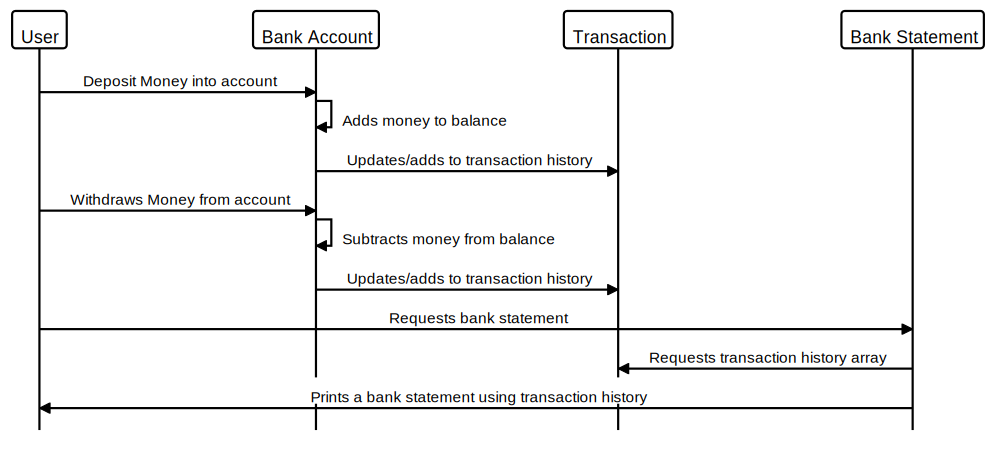
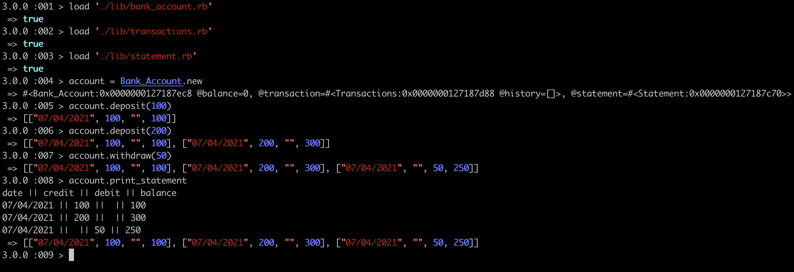
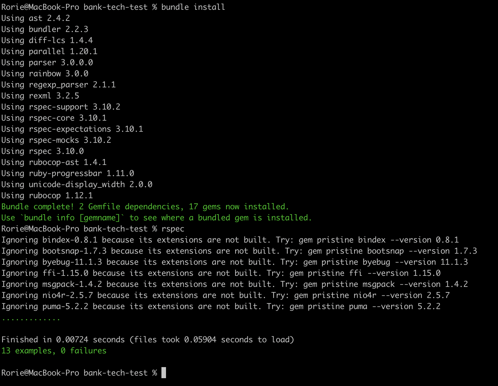

# bank-tech-test


## User Stories

```

As a user, 
So I can add to my bank account,
I would like to be able to deposit money.

As a user,
So I can access my bank account,
I would like to be able to to withdraw money.

As a user,
So I can view my transactions,
I would like to be able to print a bank statement.

```

## Sequence diagram





```

alias User="User"
alias Bank_Account="Bank Account"
alias Transaction="Transaction"
alias Bank_Statement="Bank Statement"


User->Bank_Account:"Deposit Money into account"
Bank_Account->Bank_Account:"Adds money to balance"
Bank_Account->Transaction: "Updates/adds to transaction history"
User->Bank_Account:"Withdraws Money from account"
Bank_Account->Bank_Account:"Subtracts money from balance"
Bank_Account->Transaction: "Updates/adds to transaction history"
User->Bank_Statement:"Requests bank statement"
Bank_Statement->Transaction:"Requests transaction history array"
Bank_Statement->User:"Prints a bank statement using transaction history"


```

## Description

Built in Ruby, this is a mock project that allows a user to interact with a bank account. Users are able to deposit, withdraw and print bank statements using IRB.

## How to use:

- Fork the repo and save it on your local computer
- Open the IRB console in your terminal
- Load the relevant files (Bank_account.rb, Transactions.rb, Statement.rb)
- Create a new instance of the bank account (e.g "account = Bank_Account.new")
- Make sure you deposit some money first before using any of the other functions in the programme!

### See below for a screengrab:



## Tests & how to run them:

I followed the TDD approach by using Rspec (Ruby's testing framework). All tests are passing. Follow the instructions below before running the tests:

- Make sure you have forked the repo and saved it on your local computer.
- Go into the relevant directory on your terminal
- Run "bundle install"
- Run "rspec" or "rspec -fd" to see all the tests.

### See below for a demonstration:



